# HXDS Cloud

HXDS Cloud is a full designated-driver platform repository that currently includes:

- customer WeChat mini-program: `hxds-customer-wx`
- driver WeChat mini-program: `hxds-driver-wx`
- MIS admin frontend: `hxds-mis-vue`
- Java microservice backend: `hxds/`
- cloud functions, database scripts, Docker middleware stack, and deployment documents

This README is aligned with the **current codebase**, not with older TX-LCN-era architecture notes.

## Current Version Overview

### Backend core versions

- Java: `21`
- Maven Compiler Plugin: `3.15.0`
- Spring Boot: `3.3.13`
- Spring Cloud: `2023.0.3`
- Spring Cloud Alibaba: `2023.0.3.3`
- Lombok: `1.18.30`
- Hutool: `5.6.3`

### Admin frontend versions

Based on `hxds-mis-vue/package.json`:

- Vue: `3.0.3`
- Vite: `2.1.5`
- Vue Router: `4.0.5`
- Element Plus: `1.0.2-beta.42`
- ECharts: `5.1.1`
- Less: `4.1.1`
- Sass: `1.32.8`

### Mini-program frontend dependencies

Based on `hxds-customer-wx/package.json` and `hxds-driver-wx/package.json`:

- UniApp project structure
- uView: `1.0.0`
- dayjs: `^1.10.7`
- vue-i18n: `^8.20.0`

### Distributed transactions

The current codebase uses **Seata** for distributed transaction configuration.

Seata configuration is currently present in:

- `bff-customer`
- `bff-driver`
- `hxds-cst`
- `hxds-dr`
- `hxds-odr`
- `hxds-rule`
- `hxds-mis-api`

## Current Backend Services

According to the active modules in `hxds/pom.xml`, the backend currently contains:

- `common`
- `gateway`
- `bff-customer`
- `bff-driver`
- `hxds-cst`
- `hxds-dr`
- `hxds-odr`
- `hxds-snm`
- `hxds-mps`
- `hxds-rule`
- `hxds-nebula`
- `hxds-mis-api`

## Repository Layout

```text
hxds-cloud-master
|-- hxds-customer-wx              # Customer WeChat mini-program (UniApp)
|-- hxds-driver-wx                # Driver WeChat mini-program (UniApp)
|-- hxds-mis-vue                  # MIS admin frontend (Vue 3 + Vite)
|-- hxds/                         # Java backend microservices
|   |-- common
|   |-- gateway
|   |-- bff-customer
|   |-- bff-driver
|   |-- hxds-cst
|   |-- hxds-dr
|   |-- hxds-odr
|   |-- hxds-snm
|   |-- hxds-mps
|   |-- hxds-rule
|   |-- hxds-nebula
|   `-- hxds-mis-api
|-- db/                           # Database initialization and rule SQL files
|-- docker/                       # Local/test middleware stack and container setup
|-- cloudfunctions/               # Cloud functions (currently OCR service)
|-- images/                       # README screenshots
|-- wx-miniprogram-docs/          # Mini-program capability notes
`-- tasks/                        # Refactor, deployment, and ops documents
```

## Current Capabilities

- customer order placement, designated-driver call, payment, and review
- driver dispatch, order acceptance, arrival, trip execution, and completion
- BFF aggregation, unified authentication, and downstream orchestration
- route calculation, nearby-driver matching, and location caching
- WeChat Pay, SMS, OCR, and object-storage integrations
- rule-engine driven pricing, cancellation fees, rewards, and settlement
- MIS admin operations for drivers, orders, comments, vouchers, and permissions

## Service Flow

```text
Mini-programs / MIS frontend
          ->
        Gateway
          ->
 bff-customer / bff-driver / hxds-mis-api
          ->
 cst / dr / odr / snm / mps / rule / nebula
          ->
MySQL / Redis / MongoDB / RabbitMQ / Nacos / MinIO
```

## Service Overview

| Service | Responsibility |
|---|---|
| `gateway` | unified API gateway entry |
| `bff-customer` | customer-facing mini-program aggregation |
| `bff-driver` | driver-facing mini-program aggregation |
| `hxds-cst` | customer accounts, profile, vouchers |
| `hxds-dr` | driver profile, verification, wallet, OCR-related flows |
| `hxds-odr` | order state machine, billing, payment status |
| `hxds-snm` | notifications, message center, MQ consumption |
| `hxds-mps` | route calculation, driver matching, location cache |
| `hxds-rule` | business rule engine and rule data |
| `hxds-nebula` | GPS tracks, monitoring data, analytics |
| `hxds-mis-api` | admin backend APIs |

## Runtime Dependencies

The current project depends on:

- MySQL
- Redis
- MongoDB
- RabbitMQ
- Nacos
- MinIO
- Seata
- HBase / Phoenix (only for `hxds-nebula` related scenarios)

References:

- [docker/docker-compose.yml](docker/docker-compose.yml)
- [Production deployment checklist](tasks/hxds-production-deployment-checklist.md)
- [Windows-to-Tencent-Cloud Linux operations manual](tasks/hxds-production-operations-manual-tencent-cloud.md)

## Local Development

### Backend

```bash
cd hxds
mvn clean package -DskipTests
```

Single-service example:

```bash
cd hxds/hxds-odr
mvn clean package -DskipTests
java -jar target/hxds-odr-0.0.1-SNAPSHOT.jar
```

### MIS Admin Frontend

```bash
cd hxds-mis-vue
npm install
npm run dev
```

### Mini Programs

```bash
cd hxds-customer-wx
npm install

cd ../hxds-driver-wx
npm install
```

Then compile `unpackage/dist/dev/mp-weixin/` with HBuilderX or WeChat DevTools.

## Database Scripts

Current per-database SQL files:

- `db/hxds_cst.sql`
- `db/hxds_dr.sql`
- `db/hxds_odr.sql`
- `db/hxds_rule.sql`
- `db/hxds_mis.sql`
- `db/hxds_vhr.sql`

Business rule SQL files:

- `db/代驾费规则.sql`
- `db/分账规则.sql`
- `db/取消规则.sql`
- `db/奖励规则.sql`
- `db/工作流.sql`

## Sensitive Configuration

The GitHub version should keep cloud, payment, SMS, and storage settings as environment-variable placeholders only, without committing real secrets.

Your **locally runnable setup** should continue to use real local values through environment variables or untracked local override configuration.

## Related Documents

- [Single AppID refactor plan v2](tasks/single-appid-refactor-v2.md)
- [Production deployment checklist](tasks/hxds-production-deployment-checklist.md)
- [Windows-to-Tencent-Cloud Linux operations manual](tasks/hxds-production-operations-manual-tencent-cloud.md)
- [Domain and go-live checklist](tasks/zdkjdj-production-deployment-checklist.md)
- [Nginx / gateway / mini-program domain template](tasks/nginx-gateway-wechat-domain-template.md)
- [Production docker-compose template](tasks/hxds-docker-compose-prod-template.md)

## Screenshots

### Login and registration
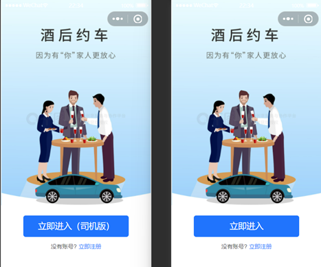

### Workbench
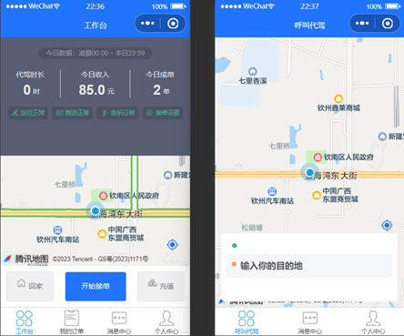

### Driver verification
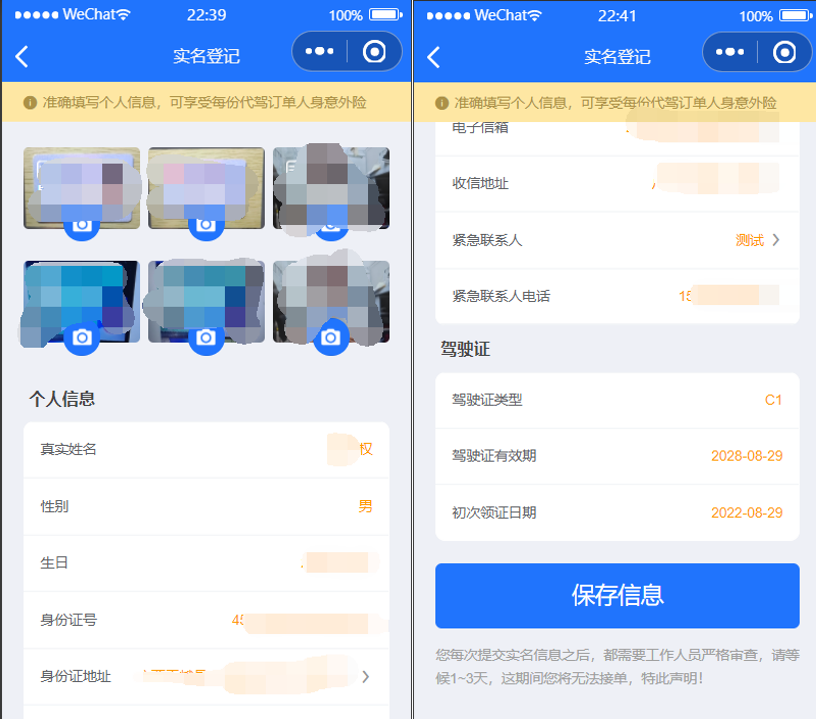

### Customer order creation
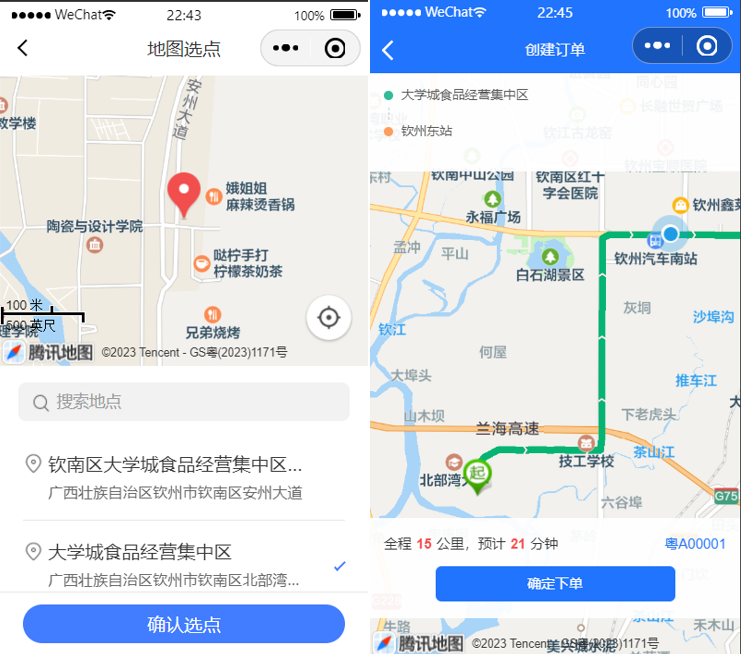

### Driver order pickup
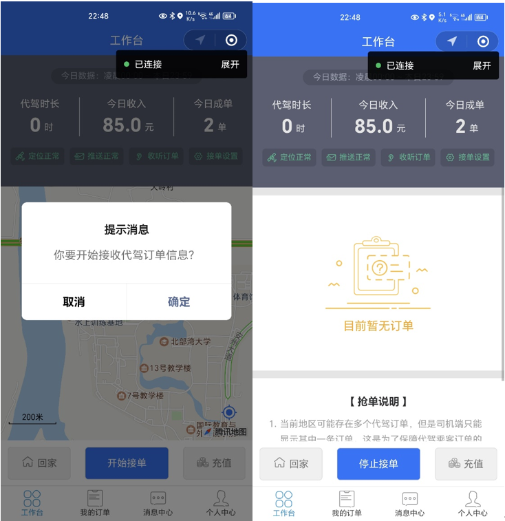

### Order state transitions
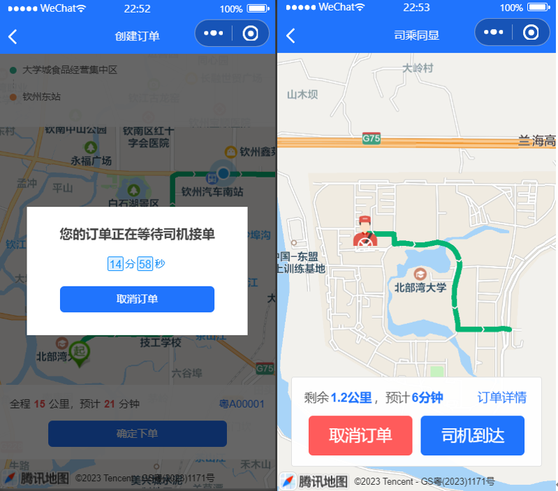
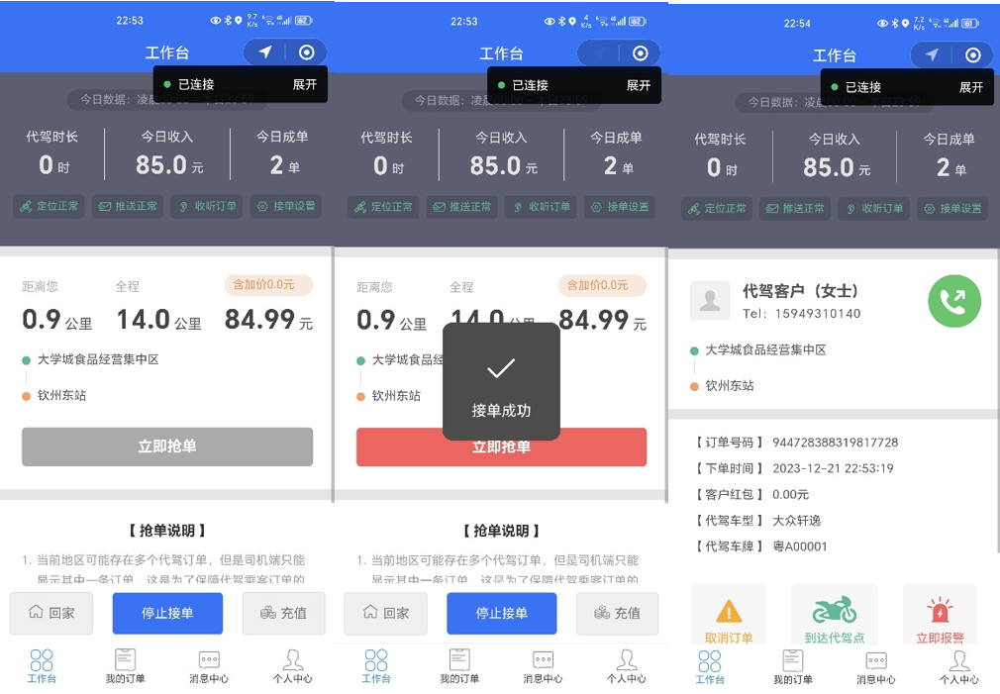

### Arrival, live trip view, completion, and payment
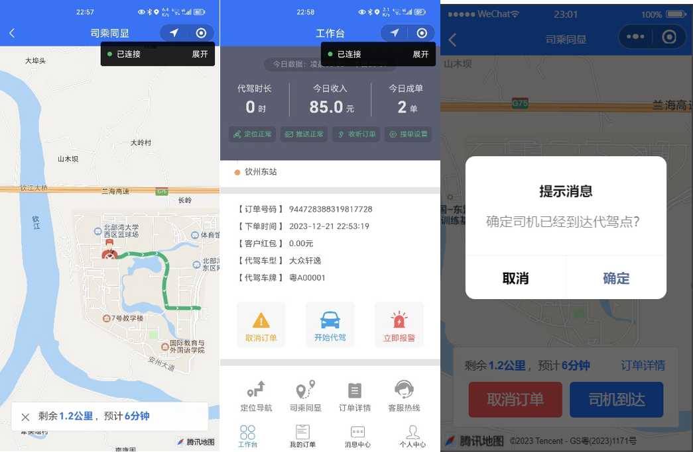
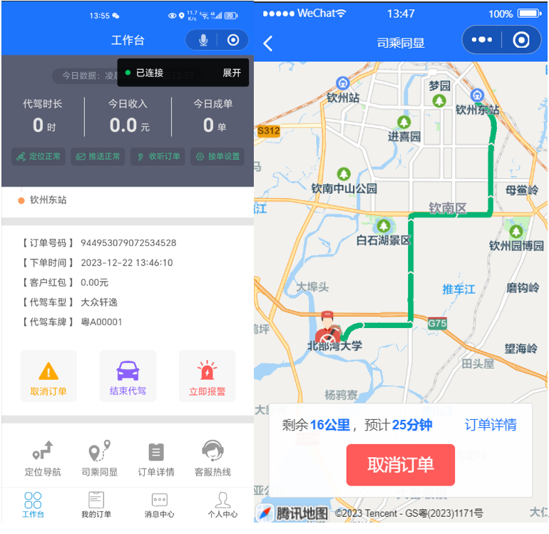
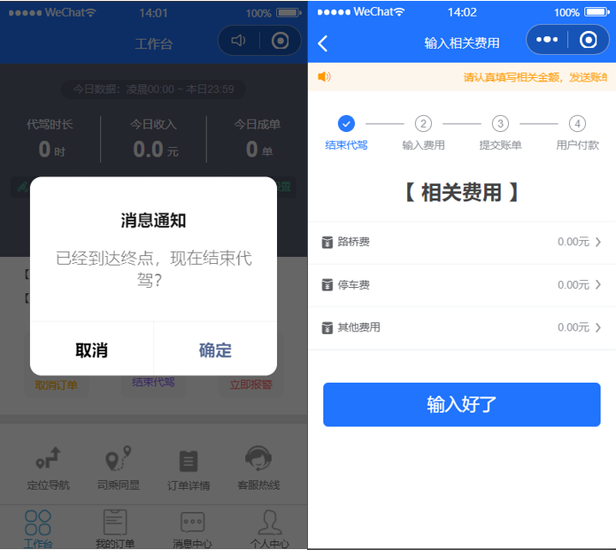
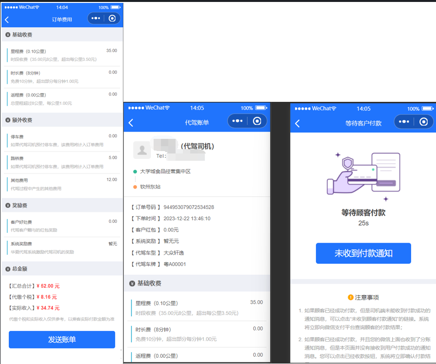
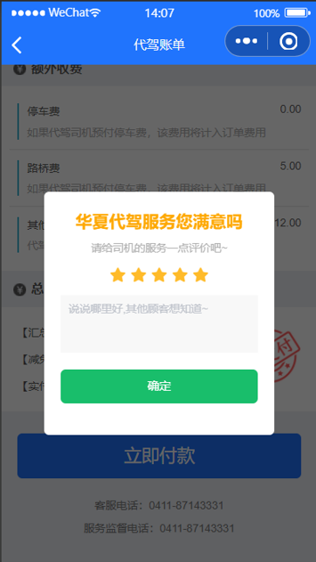

## License

- [LICENSE](LICENSE)
