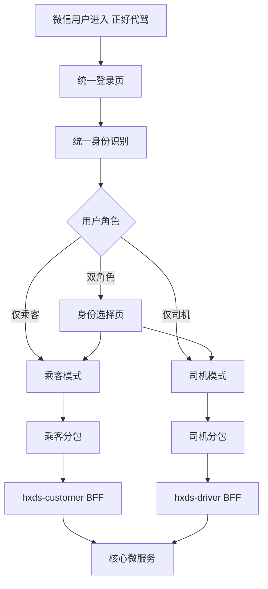

# 单 AppID 正好代驾重构实施方案 v1

## 1. 目标

在保持现有后端微服务总体结构不被一次性推翻的前提下，将当前分离的：

- `hxds-customer-wx`
- `hxds-driver-wx`

重构为一个统一品牌、统一 AppID、统一发布入口的小程序，实现：

- 用户搜索 `正好代驾` 进入同一个小程序
- 小程序内根据用户角色进入乘客模式或司机模式
- 同一个微信用户可同时具备乘客、司机两种身份
- 通过分包降低主包体积并隔离乘客/司机复杂业务
- 保持现有订单、支付、消息、地图、司机认证等核心链路可逐步迁移

## 2. 现状概览

### 2.1 当前前端形态

- 乘客端工程：`D:\daijia\hxds-cloud-master\hxds-cloud-master\hxds-customer-wx`
- 司机端工程：`D:\daijia\hxds-cloud-master\hxds-cloud-master\hxds-driver-wx`

乘客端主要页面：

- 登录、注册
- 工作台
- 起终点输入
- 下单
- 乘车同显
- 支付
- 消息
- 我的

司机端主要页面：

- 登录、注册
- 工作台
- 接单/执行
- 订单列表
- 消息
- 我的
- 热点图
- OCR/实名认证
- 钱包/罚款/接单设置等分包能力

### 2.2 当前后端形态

后端是典型双 BFF + 多微服务：

- 乘客 BFF：`/hxds-customer/**`
- 司机 BFF：`/hxds-driver/**`
- 顾客身份服务：`hxds-cst`
- 司机身份服务：`hxds-dr`
- 订单：`hxds-odr`
- 地图/GPS：`hxds-mps`
- 消息：`hxds-snm`

### 2.3 当前最大问题

1. 用户入口分裂
- 搜索品牌后不能统一进入一个小程序

2. 身份体系分裂
- 同一个微信用户在乘客和司机两套小程序中分别登录

3. 前端壳分裂
- 两套 `App.vue/pages.json/main.js`，维护成本高

4. 体积风险高
- 乘客端主包已接近限制，直接合并必然超包

5. 发布和回归成本高
- 每次功能迭代都需要双端同步验证

## 3. 总体方案

### 3.1 总体原则

采用：

- 一个 AppID
- 一个统一小程序工程
- 角色路由
- 分包承载双业务
- 后端先复用、前端先统一

### 3.2 推荐主工程

建议以当前乘客端工程为统一品牌主工程基座：

- `D:\daijia\hxds-cloud-master\hxds-cloud-master\hxds-customer-wx`

原因：

- 乘客端更适合作为用户搜索后的品牌主入口
- 该工程已经在当前 AppID 上运行和审核
- 支付、消息、地图、下单等用户链路已经聚焦在该 AppID 上

### 3.3 最终架构



## 4. 前端重构方案

### 4.1 新的小程序结构

建议新建统一工程目录，例如：

- `D:\daijia\hxds-cloud-master\hxds-cloud-master\hxds-super-wx`

如果短期不新建目录，也可先在 `hxds-customer-wx` 上重构，但长期推荐独立目录，避免历史遗留页面继续污染品牌主工程。

### 4.2 目录规划

```text
hxds-super-wx/
  App.vue
  main.js
  manifest.json
  pages.json
  common/
  static/
  components/
  pages/
    login/
    role_select/
    home/
    message/
    message_list/
    mine/
    order_list/
    settings/
    about_us/
    privacy_policy/
    user_agreement/
  pkg-customer/
    workbench/
    create_order/
    car_list/
    add_car/
    move/
    order/
    voucher_list/
  pkg-driver/
    workbench/
    order/
    move/
    wallet/
    heat_chart/
    fine_list/
    account/
    settings/
  pkg-driver-auth/
    register/
    filling/
    identity_camera/
    face_camera/
    ocr_camera/
  custom-tab-bar/
```

### 4.3 主包页面边界

主包只保留品牌公共能力，目标是尽可能轻：

- 登录页
- 身份选择页
- 首页壳页
- 统一订单列表壳页
- 消息列表/消息详情
- 我的
- 设置
- 法务页

不把重业务页面放进主包：

- 乘客下单详情、支付、路线
- 司机听单、接单、执行、钱包、认证

### 4.4 分包策略

#### 乘客分包 `pkg-customer`

迁入页面：

- `workbench`
- `create_order`
- `car_list`
- `add_car`
- `move`
- `order`
- `voucher_list`

#### 司机业务分包 `pkg-driver`

迁入页面：

- `workbench`
- `order`
- `move`
- `wallet`
- `heat_chart`
- `fine_list`
- `account`
- `settings`

#### 司机认证分包 `pkg-driver-auth`

迁入页面：

- 司机注册
- 实名认证
- OCR 相机
- 人脸识别

### 4.5 tabBar 方案

第一版建议保守实现，使用统一四入口：

- 首页
- 订单
- 消息
- 我的

不同角色下映射不同内容：

- 乘客模式
  - 首页：叫代驾
  - 订单：乘客订单
- 司机模式
  - 首页：司机工作台
  - 订单：司机接单/执行订单

第二版如需视觉更统一，再改成自定义 `tabBar`。

### 4.6 路由方案

统一入口逻辑：

1. 小程序启动
2. 检查 token
3. 未登录跳登录页
4. 已登录获取角色列表
5. 根据角色决定：
- 单角色直接进对应模式首页
- 双角色进入身份选择页

建议新增本地状态：

- `activeRole = customer | driver`
- `roles = []`

### 4.7 页面迁移原则

1. 只迁源码，不迁 `unpackage/dist`
2. 先迁公共能力，再迁乘客，再迁司机
3. 公共组件优先抽到 `components/` 和 `common/`
4. 司机与乘客重名页面不得直接覆盖，迁入后重命名到分包目录

## 5. 登录与身份体系方案

### 5.1 统一登录目标

同一个微信 `openId` 下，允许用户拥有：

- 乘客身份
- 司机身份
- 双身份

### 5.2 建议流程

统一登录后，前端或统一 BFF 执行：

1. 调微信 `login` 获取 `code`
2. 后端换取 `openId`
3. 查询该 `openId` 是否存在顾客身份
4. 查询该 `openId` 是否存在司机身份
5. 返回统一登录结果：

```json
{
  "openId": "xxx",
  "roles": ["customer", "driver"],
  "defaultRole": "customer",
  "customerToken": "xxx",
  "driverToken": "xxx"
}
```

### 5.3 角色判断结果

- 无角色：进入注册引导页
- 仅乘客：进入乘客模式
- 仅司机：进入司机模式
- 双角色：进入身份选择页

### 5.4 司机注册定位

司机注册不再是单独小程序入口，而是统一小程序中的：

- 我的
- 成为司机
- 司机认证分包

## 6. 后端改造方案

### 6.1 短期方案

短期不强推翻现有后端：

- 继续保留 `bff-customer`
- 继续保留 `bff-driver`
- 统一前端工程按角色分别调用两套路由

优点：

- 风险低
- 可快速完成单 AppID 品牌入口
- 不影响现有微服务职责

### 6.2 中期方案

新增统一聚合层，建议命名：

- `bff-app`

职责：

- 统一登录
- 统一角色查询
- 统一角色切换
- 首页路由判断
- 用户公共资料聚合
- 公共消息、设置、品牌配置

### 6.3 统一登录接口建议

新增接口示例：

- `POST /hxds-app/auth/login`
- `GET /hxds-app/auth/profile`
- `POST /hxds-app/auth/switchRole`

### 6.4 token 策略

推荐两阶段：

第一阶段：

- 保留 `customerToken`
- 保留 `driverToken`
- 前端按 `activeRole` 切换使用对应 token

第二阶段：

- 统一为 `appToken`
- BFF-App 内部代理不同角色调用

### 6.5 数据层约束

需要确认：

- 顾客表和司机表是否都使用同一 `open_id`
- 同一手机号是否允许同时绑定两个身份
- 司机身份是否允许从已存在顾客资料补全

建议：

- 统一以 `open_id` 作为跨角色主关联键
- 手机号只做联系方式，不做跨系统主身份

## 7. 迁移范围

### 7.1 第一阶段迁移

目标：品牌统一入口可跑

- 统一登录页
- 身份选择页
- 乘客主链路
- 消息中心
- 我的

结果：

- 用户可以从一个小程序进入乘客模式
- 司机入口仅作为“切换/注册入口”存在

### 7.2 第二阶段迁移

目标：司机主业务进入统一小程序

- 司机工作台
- 接单/执行
- 司机订单页
- 司机钱包
- 司机设置

### 7.3 第三阶段迁移

目标：司机认证全量迁入

- OCR
- 身份证识别
- 人脸识别
- 成为司机流程

### 7.4 第四阶段收口

目标：旧司机小程序下线

- 停止新增司机端功能
- 旧司机小程序仅保留跳转公告或彻底停用

## 8. 页面与功能映射

### 8.1 保留为公共页

- 登录
- 消息列表
- 消息详情
- 我的
- 设置
- 协议/隐私/关于我们

### 8.2 乘客页迁入

来源：

- `hxds-customer-wx/pages/*`

迁入：

- `pkg-customer/*`

### 8.3 司机页迁入

来源：

- `hxds-driver-wx/pages/*`
- `hxds-driver-wx/identity/*`
- `hxds-driver-wx/user/*`
- `hxds-driver-wx/wallet/*`
- `hxds-driver-wx/execution/*`
- `hxds-driver-wx/order/*`
- `hxds-driver-wx/rule/*`

迁入：

- `pkg-driver/*`
- `pkg-driver-auth/*`

## 9. 包体积与性能方案

### 9.1 体积控制原则

必须执行：

- 主包只保留轻页
- 地图、OCR、司机执行、钱包、规则页全部进分包
- 能删的静态资源先删
- 重复图片和重复组件统一收口

### 9.2 配置建议

在 `app.json/pages.json` 中使用：

- `subPackages`
- `preloadRule`
- `lazyCodeLoading`

### 9.3 插件控制

当前乘客端已有：

- `WechatSI`
- `routePlan`
- `chooseLocation`

合并时要重新审查：

- 哪些插件只在司机分包用
- 哪些插件只在乘客分包用
- 是否有插件可以替换或延迟进入后再加载

## 10. 风险与难点

### 10.1 最大风险

1. 登录身份统一
- 双 BFF 的 token 和角色切换逻辑复杂

2. 页面命名冲突
- 两端都存在 `login/workbench/message/mine/order` 等页面名

3. 主包超限
- 如果不先做目录拆分，合并后会立即超过微信主包限制

4. 司机链路实时性
- 司机端工作台、执行页、地图、OCR 对运行稳定性要求高

5. 回归面大
- 一次修改影响乘客和司机两套主业务

### 10.2 规避策略

- 先建立新壳，不在旧壳上硬拼
- 先跑通乘客，再接司机
- 先保留双 BFF，再做统一 BFF
- 所有重业务页进分包
- 旧司机小程序保留一段灰度期

## 11. 实施阶段计划

### Phase 1：方案落地与工程初始化

- 新建统一前端工程
- 复制乘客端公共依赖
- 建立新的 `pages.json`
- 建立主包 + 分包骨架

### Phase 2：公共壳与统一登录

- 登录页
- 身份选择页
- 公共消息中心
- 我的
- 设置

### Phase 3：迁移乘客业务

- 工作台
- 下单
- 同显
- 支付
- 订单

### Phase 4：迁移司机业务

- 工作台
- 接单
- 执行
- 钱包
- 司机订单

### Phase 5：迁移司机认证

- 注册
- OCR
- 人脸识别
- 成为司机

### Phase 6：统一 BFF 收口

- 新增统一登录与角色查询接口
- 统一 token 管理

### Phase 7：联调与发布

- 体积优化
- 全链路测试
- 提审
- 旧司机小程序灰度下线

## 12. 第一版交付目标

v1 不追求一步到位替代全部双端逻辑，交付目标是：

1. 同一个小程序可以登录
2. 同一个小程序可以识别乘客/司机角色
3. 乘客模式主链路闭环可跑
4. 司机模式至少可进入工作台与订单页
5. 包结构可持续扩展，不再继续双壳维护

## 13. 推荐下一步

建议下一步立即进入详细设计与拆任务阶段，输出三份配套文件：

1. `单 AppID 重构需求文档`
2. `单 AppID 技术设计文档`
3. `单 AppID 分阶段任务清单`

建议优先落地顺序：

1. 新统一工程目录和 `pages.json` 分包骨架
2. 统一登录/角色选择页
3. 乘客主链路迁移
4. 司机工作台迁移
5. 统一 BFF 设计与接入
