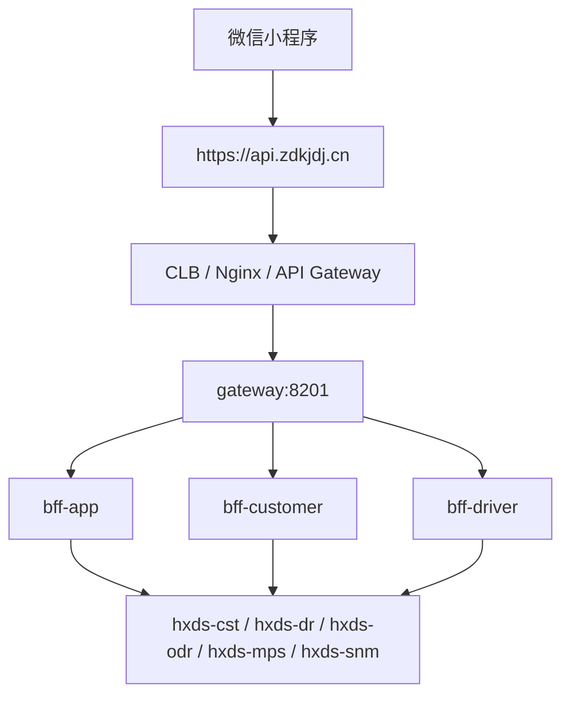

# 单 AppID 正好代驾重构实施方案 v2（修正版）

## 1. 文档目的

本文件用于替代 `v1` 方案中偏“方向性”、但尚未充分落入生产约束的部分。

本次修正版重点补齐：

- 单 AppID 合并中最容易被低估的错误假设
- 微信官方与微信支付官方的硬约束
- 当前项目代码与数据模型中的真实阻力
- `zdkjdj.cn` 域名、备案、证书、API 域名、支付回调域名的正确落地方式
- 一个能够真正走向上线的实施顺序

## 2. 最终目标

目标不是“把两个前端项目拼成一个目录”，而是：

1. 微信用户可以在微信内搜索并打开一个正式上线的小程序 `正好代驾`
2. 用户进入后可作为乘客使用：
- 登录
- 输入起点终点
- 呼叫代驾
- 查看订单和轨迹
- 发起支付
3. 用户进入后也可作为司机使用：
- 登录
- 进入工作台
- 在线听单
- 接单
- 执行订单
- 查看订单
4. 同一个微信用户允许同时拥有：
- 乘客身份
- 司机身份
- 双身份切换能力

## 3. 对 v1 的 critical appraisal

## 3.1 v1 正确的地方

v1 的大方向是对的：

- 采用一个 AppID
- 采用一个统一小程序壳
- 用角色路由切换乘客/司机模式
- 用分包承载双业务
- 短期复用现有后端微服务

这些方向与微信小程序当前官方能力不冲突。

官方文档：

- 分包：[https://developers.weixin.qq.com/miniprogram/dev/framework/subpackages.html](https://developers.weixin.qq.com/miniprogram/dev/framework/subpackages.html)
- app.json 配置：[https://developers.weixin.qq.com/miniprogram/dev/reference/configuration/app.html](https://developers.weixin.qq.com/miniprogram/dev/reference/configuration/app.html)
- 自定义 tabBar：[https://developers.weixin.qq.com/miniprogram/dev/framework/ability/custom-tabbar.html](https://developers.weixin.qq.com/miniprogram/dev/framework/ability/custom-tabbar.html)

## 3.2 v1 的核心错误与缺口

### 错误 1：把“单 AppID 合并”理解成主要是前端工程问题

这是 v1 最大的问题。

真实情况是：

- 你当前顾客、司机两套身份体系都主要以 `open_id` 为主键
- 但一旦改成“一个新的最终品牌 AppID”，微信登录得到的 `openid` 就可能改变
- 所以这不是“复制页面”的问题，而是“身份主键迁移”的问题

代码和库层证据：

- [MicroAppUtil.java](D:/daijia/hxds-cloud-master/hxds-cloud-master/hxds/common/src/main/java/com/example/hxds/common/util/MicroAppUtil.java)
- [CustomerDao.xml](D:/daijia/hxds-cloud-master/hxds-cloud-master/hxds/hxds-cst/src/main/resources/mapper/CustomerDao.xml)
- `db/mysql_1.sql`、`db/mysql_2.sql` 中顾客表和司机表都对 `open_id` 设置了唯一索引

### 错误 2：没有把 UnionID 设计前移到 Phase 0

微信官方明确说明：

- 同一个微信开放平台账号下，多个应用/小程序/公众号的同一用户具有唯一的 `UnionID`
- 绑定开放平台后，小程序可以通过 `wx.login + code2Session` 获取 `UnionID`

官方文档：

- UnionID 机制说明：[https://developers.weixin.qq.com/miniprogram/dev/framework/open-ability/union-id.html](https://developers.weixin.qq.com/miniprogram/dev/framework/open-ability/union-id.html)
- 小程序登录凭证校验：[https://developers.weixin.qq.com/miniprogram/dev/server/API/user-login/api_code2session.html](https://developers.weixin.qq.com/miniprogram/dev/server/API/user-login/api_code2session.html)
- 支付后获取 UnionID：[https://developers.weixin.qq.com/miniprogram/dev/server/API/user-info/basic-info/api_getpaidunionid.html](https://developers.weixin.qq.com/miniprogram/dev/server/API/user-info/basic-info/api_getpaidunionid.html)

因此，正确结论是：

- 如果继续用 `openid` 做跨 AppID 唯一用户主键，合并方案存在高风险
- 正确的跨小程序用户桥接主键应该是 `unionid`

### 错误 3：把统一 BFF 放得太靠后

v1 建议“先前端统一，后面再考虑统一 BFF”，这个顺序风险偏高。

因为当前系统实际上有两套登录态：

- `bff-customer`
- `bff-driver`

如果前端先合并，但没有统一角色识别和统一 token 策略，就会出现：

- 一个壳里同时塞两套 token
- 同一个用户在两个模式下的登录状态不一致
- 前端路由切换复杂化

### 错误 4：没有把支付绑定当作前置条件

你未来的小程序支付能否稳定运行，不取决于页面长什么样，而取决于：

- 最终品牌 AppID 是否与微信支付商户号完成绑定
- 后端统一下单时是否使用了正确的 `appid + mchid`
- 支付回调地址是否为真实公网 HTTPS 地址

官方文档：

- 开发必要参数说明：[https://pay.wechatpay.cn/doc/v3/merchant/4013070756](https://pay.wechatpay.cn/doc/v3/merchant/4013070756)
- 管理商户号绑定的 APPID 账号：[https://pay.wechatpay.cn/doc/v3/merchant/4013287010](https://pay.wechatpay.cn/doc/v3/merchant/4013287010)
- JSAPI/小程序支付下单：[https://pay.wechatpay.cn/doc/v3/merchant/4012791897](https://pay.wechatpay.cn/doc/v3/merchant/4012791897)
- 支付成功回调通知：[https://pay.wechatpay.cn/doc/v3/merchant/4012791902](https://pay.wechatpay.cn/doc/v3/merchant/4012791902)
- 回调通知注意事项：[https://pay.wechatpay.cn/doc/v2/partner/4011984734](https://pay.wechatpay.cn/doc/v2/partner/4011984734)

### 错误 5：没有把“生产域名和备案”当成上线前置条件

微信官方现在仍然明确要求：

- 小程序请求域名必须使用 `https`
- 不能使用 IP 地址
- 不能使用 `localhost`
- 域名必须经过 ICP 备案
- `web-view` 业务域名也必须是 HTTPS 且ICP备案

官方文档：

- 网络能力与服务器域名：[https://developers.weixin.qq.com/miniprogram/dev/framework/ability/network.html](https://developers.weixin.qq.com/miniprogram/dev/framework/ability/network.html)
- 业务域名：[https://developers.weixin.qq.com/miniprogram/dev/framework/ability/domain.html](https://developers.weixin.qq.com/miniprogram/dev/framework/ability/domain.html)
- 腾讯云 ICP 备案小程序操作：[https://cloud.tencent.com/document/product/243/55796](https://cloud.tencent.com/document/product/243/55796)

所以：

- 你不能长期用 `127.0.0.1:8201`
- 不能最终以“本地开发地址”上线
- 必须要有真实公网域名和真实证书

### 错误 6：没有把主包体积预算放到最前面

微信官方当前限制仍然是：

- 整个小程序所有分包总大小不超过 `30M`
- 单个主包/单个分包不超过 `2M`

官方文档：

- 分包：[https://developers.weixin.qq.com/miniprogram/dev/framework/subpackages.html](https://developers.weixin.qq.com/miniprogram/dev/framework/subpackages.html)

而你项目实际情况是：

- 乘客端之前单独上传就已经触碰过主包上限
- 如果不先做“包体积分配表”，合并司机端后几乎必然再次超限

## 4. 修正版总体结论

结论不是“不能做”，而是：

- 可以做
- 但必须先做身份层和生产基础设施
- 前端壳合并必须排在这些硬约束之后

换句话说：

- **单 AppID 品牌化可行**
- **直接按 v1 从页面迁移开始，不稳**

## 5. 修正版总方案

## 5.1 核心原则

采用：

- 一个最终品牌 AppID
- 一个统一小程序源码工程
- 一个统一角色识别层
- `unionid` 作为跨历史小程序身份桥接键
- 分包承载乘客/司机复杂业务
- 统一公网 API 域名
- 统一支付回调域名

## 5.2 建议的最终身份模型

新增统一账号域，而不是继续让前端同时记住两套旧身份。

建议新增统一账号表：

```text
app_user
  id
  unionid
  current_app_openid
  mobile
  default_role
  status
  create_time

app_user_role
  id
  app_user_id
  role_type(customer/driver)
  role_ref_id
```

说明：

- `unionid` 是跨旧小程序与新品牌小程序的用户桥接主键
- `current_app_openid` 是当前最终品牌 AppID 下的小程序 openid
- `role_ref_id` 指向旧体系中的顾客 ID 或司机 ID

## 5.3 对现有表的修正建议

保留现有：

- 顾客表
- 司机表
- 顾客订单
- 司机订单

不要第一阶段强行把所有顾客表/司机表合成一张。

第一阶段只做：

- 新增统一用户域
- 建映射关系
- 让前端按角色进入旧业务域

## 6. 修正版实施顺序

## Phase 0：统一身份和开放平台前置条件

这是必须新增的阶段。

### 要做什么

1. 把相关小程序都绑定到同一个微信开放平台账号
2. 验证当前系统能获取 `unionid`
3. 新增统一账号表与角色映射表
4. 写一次性迁移脚本：
- 把旧乘客小程序用户映射入统一用户域
- 把旧司机小程序用户映射入统一用户域
5. 设计“同一手机号/同一 unionid 双角色”的处理规则

### 不做会怎样

- 老乘客和老司机账号无法平滑合并
- 同一个人会被系统当成两个不同用户
- 后面所有“角色切换”都会变成假切换

## Phase 1：支付和域名前置条件

### 要做什么

1. 确认最终品牌 AppID
2. 将最终 AppID 与微信支付商户号绑定
3. 准备真实公网域名
4. 配置 HTTPS 证书
5. 配置 ICP 备案
6. 配置 API 域名和支付回调地址

### 不做会怎样

- 小程序正式版无法合法请求生产接口
- 支付链路无法稳定运行
- 微信支付回调无法到达公网

## Phase 2：统一前端壳

### 要做什么

1. 新建统一前端工程
2. 登录页
3. 身份选择页
4. 统一消息中心
5. 我的
6. 设置
7. 法务页
8. 统一四 tab 壳

## Phase 3：迁移乘客闭环

目标：

- 单 AppID 下，乘客完整业务可上线

包含：

- 叫代驾
- 下单
- 订单
- 同显
- 支付

## Phase 4：迁移司机接单闭环

目标：

- 单 AppID 下，司机可在线接单、执行订单

包含：

- 工作台
- 听单/接单
- 订单
- 执行页

## Phase 5：迁移司机认证、OCR、钱包

这部分权限和审核复杂度最高，最后迁。

## Phase 6：统一 BFF 收口

建议新增：

- `bff-app`

职责：

- 统一登录
- 统一角色查询
- 统一资料聚合
- 统一切换角色
- 统一前端 token 模型

## 7. 前端结构修正版

## 7.1 工程策略

不建议继续直接在现有 `hxds-customer-wx` 上堆叠最终版。

建议新建统一工程：

- `D:\daijia\hxds-cloud-master\hxds-cloud-master\hxds-super-wx`

原因：

- 便于摆脱当前源码/运行产物分叉问题
- 避免旧项目目录继续承载过多历史逻辑
- 便于按品牌主工程重新定义目录结构

## 7.2 推荐目录

```text
hxds-super-wx/
  App.vue
  main.js
  manifest.json
  pages.json
  common/
  components/
  static/
  pages/
    login/
    role_select/
    home/
    order_list/
    message_list/
    message/
    mine/
    settings/
    about_us/
    privacy_policy/
    user_agreement/
  pkg-customer/
    workbench/
    create_order/
    car_list/
    add_car/
    move/
    order/
    voucher_list/
  pkg-driver/
    workbench/
    order/
    move/
    wallet/
    account/
    settings/
    fine_list/
    heat_chart/
  pkg-driver-auth/
    register/
    filling/
    identity_camera/
    face_camera/
    ocr_camera/
  custom-tab-bar/
```

## 7.3 tabBar 修正版意见

第一版仍建议用统一四入口：

- 首页
- 订单
- 消息
- 我的

但要明确：

- 首页在乘客模式下映射为乘客工作台
- 首页在司机模式下映射为司机工作台
- 订单在乘客/司机模式下映射不同页面

## 7.4 包体积分配原则

必须在开工前写一张“包体积分配表”：

- 主包只放公共壳
- 地图、OCR、司机执行页、钱包、规则页全部放分包
- 静态资源统一去重
- 公共组件统一收口

## 8. 后端修正版

## 8.1 短期原则

保留现有：

- `bff-customer`
- `bff-driver`

但新增：

- `bff-app`

### 原因

如果没有 `bff-app`：

- 前端要自己管理两套 token
- 前端要自己判断双身份
- 前端要自己做角色切换

这会导致：

- 前端复杂度极高
- 安全边界不清晰
- 后续维护困难

## 8.2 bff-app 第一阶段接口建议

建议最少先做：

- `POST /hxds-app/auth/login`
- `GET /hxds-app/auth/profile`
- `POST /hxds-app/auth/switchRole`
- `GET /hxds-app/auth/roles`

返回结构建议：

```json
{
  "appToken": "xxx",
  "unionid": "xxx",
  "roles": ["customer", "driver"],
  "activeRole": "customer",
  "customerProfile": {},
  "driverProfile": {}
}
```

## 8.3 token 策略修正版

不建议长期让前端并存 `customerToken` 和 `driverToken`。

推荐：

- 对前端只发一个 `appToken`
- `bff-app` 内部再代理到顾客或司机业务域

这样更接近最终统一小程序的稳定结构。

## 9. 域名、备案、证书与公网部署方案

## 9.1 `zdkjdj.cn` 现在能做什么

`zdkjdj.cn` 可以做：

- 小程序后端的统一 API 域名的主域
- 小程序支付回调的域名
- 管理后台域名
- H5/协议/活动页域名

但它**不是后台程序本身**，只是域名入口。

你真正还需要：

- DNS 解析
- 公网服务器或负载均衡
- HTTPS 证书
- ICP 备案
- Nginx 或 API 网关

## 9.2 当前实测状态

本地检查结果：

- `zdkjdj.cn` 当前只看到了 DNS SOA 信息
- 没看到有效的 `A / AAAA / CNAME` 公网记录
- `https://zdkjdj.cn` 当前无法解析到可访问站点

因此结论是：

- 这个域名目前还没有真正“承载你的线上服务”

## 9.3 推荐域名规划

建议这样拆：

- `api.zdkjdj.cn`
  - 给微信小程序 `wx.request`、`uploadFile`、`downloadFile` 使用
- `admin.zdkjdj.cn`
  - 给 `hxds-mis-vue` 管理后台
- `h5.zdkjdj.cn`
  - 给协议页、关于我们、活动页、未来 `web-view`
- `www.zdkjdj.cn`
  - 给品牌官网

## 9.4 `api.zdkjdj.cn` 是否需要重新注册

不需要单独注册。

原因：

- `api.zdkjdj.cn` 是 `zdkjdj.cn` 的子域名
- 一般不需要重新购买或重新注册
- 只需要在 DNS 服务商处为 `zdkjdj.cn` 新增一条解析记录即可

通常做法：

- 方式 1：A 记录
  - `api` -> 你的云服务器公网 IP
- 方式 2：CNAME 记录
  - `api` -> 你的负载均衡或网关提供的 CNAME

对应腾讯云官方文档：

- 云解析 DNS：[https://cloud.tencent.com/document/product/302](https://cloud.tencent.com/document/product/302)

## 9.5 小程序请求域名的官方限制

微信官方要求：

- 只支持 HTTPS/WSS
- 不能使用 IP 地址
- 不能使用 localhost
- 域名必须 ICP 备案
- 证书必须有效

官方文档：

- 网络能力与服务器域名：[https://developers.weixin.qq.com/miniprogram/dev/framework/ability/network.html](https://developers.weixin.qq.com/miniprogram/dev/framework/ability/network.html)

## 9.6 web-view 业务域名的官方限制

如果未来你要在小程序里打开协议页、活动页或 H5：

- 需要配置业务域名
- 业务域名也必须 HTTPS
- 业务域名也必须 ICP 备案

官方文档：

- 业务域名：[https://developers.weixin.qq.com/miniprogram/dev/framework/ability/domain.html](https://developers.weixin.qq.com/miniprogram/dev/framework/ability/domain.html)

## 9.7 推荐公网部署拓扑

推荐只暴露一个公网 API 入口，而不是所有微服务全都暴露公网。



## 9.8 推荐支付回调地址

微信支付回调建议使用：

- `https://api.zdkjdj.cn/pay/notify/wechat/miniprogram`

注意：

- 必须是公网可达完整 URL
- 不要带 query 参数
- 回调要在 5 秒内正确应答

官方文档：

- 支付成功回调通知：[https://pay.wechatpay.cn/doc/v3/merchant/4012791902](https://pay.wechatpay.cn/doc/v3/merchant/4012791902)
- 回调通知注意事项：[https://pay.wechatpay.cn/doc/v2/partner/4011984734](https://pay.wechatpay.cn/doc/v2/partner/4011984734)

## 9.9 备案建议

如果你最终在中国大陆部署：

- `zdkjdj.cn` 要完成域名实名认证
- 要完成ICP备案
- 备案主体要与你小程序/企业主体一致或可对应

腾讯云备案官方文档：

- 备案小程序操作：[https://cloud.tencent.com/document/product/243/55796](https://cloud.tencent.com/document/product/243/55796)

## 10. 最终推荐路线

按稳妥程度排序，我建议你这样走：

1. 确认最终品牌 AppID
2. 绑定开放平台，打通 UnionID
3. 新增统一账号域和角色映射
4. 确认微信支付商户号与最终 AppID 的绑定
5. 建好 `zdkjdj.cn` 的生产基础设施：
- DNS
- SSL
- ICP 备案
- API 入口
6. 新建统一前端工程 `hxds-super-wx`
7. 新增 `bff-app`
8. 先迁乘客完整闭环
9. 再迁司机接单闭环
10. 最后迁司机认证/钱包/OCR

## 11. 最终结论

### 对 v1 的最终评价

`v1` 不是错，而是不够严谨。

它适合作为：

- 方向性方案

但不适合作为：

- 直接开工的最终生产实施方案

### 对 v2 的最终评价

`v2` 把真正的生产硬约束前移了：

- `UnionID`
- 统一账号域
- 统一 BFF
- 支付商户绑定
- 真实生产域名
- 备案
- 证书

只有在这些条件先成立的前提下，你的“一个正常的代驾小程序”目标才是稳的。
