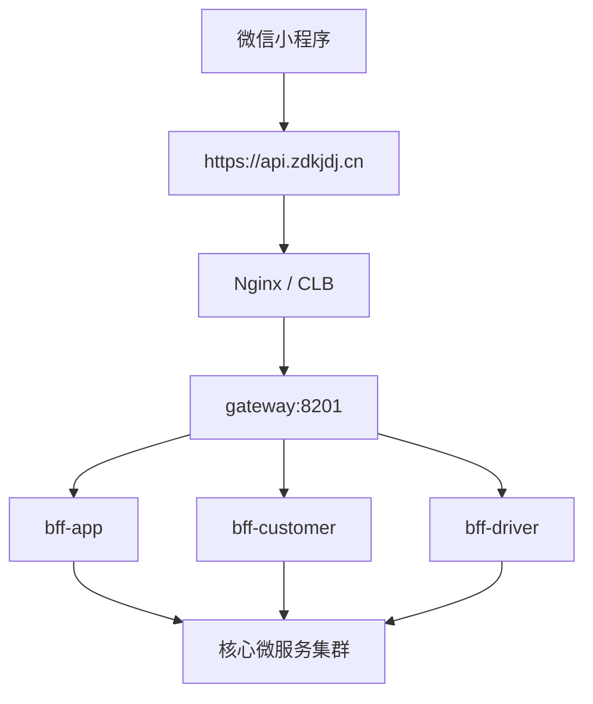

# zdkjdj.cn 上线生产部署与域名配置实施清单

## 1. 目标

将 `zdkjdj.cn` 真正接入生产环境，使微信小程序正式版可以通过合法 HTTPS 域名访问后端服务，并支持微信支付回调。

目标产出：

- `api.zdkjdj.cn` 作为小程序 API 公网入口
- `admin.zdkjdj.cn` 作为管理后台入口
- `h5.zdkjdj.cn` 作为协议页 / 活动页 / web-view 入口
- `https://api.zdkjdj.cn/pay/notify/wechat/miniprogram` 作为微信支付回调地址

## 2. 官方硬约束

### 微信小程序服务器域名

微信官方要求：

- 小程序请求域名只能使用 `https`
- WebSocket 只能使用 `wss`
- 不能使用 IP 地址
- 不能使用 `localhost`
- 域名必须经过 ICP 备案
- HTTPS 证书必须有效

官方文档：

- 服务器域名与网络能力  
  [https://developers.weixin.qq.com/miniprogram/dev/framework/ability/network.html](https://developers.weixin.qq.com/miniprogram/dev/framework/ability/network.html)

### 微信小程序业务域名

如果要在小程序中使用 `web-view` 打开网页：

- 业务域名必须使用 `https`
- 业务域名必须经过 ICP 备案

官方文档：

- 业务域名  
  [https://developers.weixin.qq.com/miniprogram/dev/framework/ability/domain.html](https://developers.weixin.qq.com/miniprogram/dev/framework/ability/domain.html)

### 微信支付回调

微信支付官方要求：

- 回调地址为下单接口传入的 `notify_url`
- 微信支付会以 `POST` 方式通知
- 商户需要对回调内容验签
- 如果有防火墙策略，需要放行微信支付回调 IP 段

官方文档：

- 支付成功回调通知（小程序支付）  
  [https://pay.wechatpay.cn/doc/v3/merchant/4012791902](https://pay.wechatpay.cn/doc/v3/merchant/4012791902)
- JSAPI / 小程序支付开发指引  
  [https://pay.wechatpay.cn/doc/v3/merchant/4012791870](https://pay.wechatpay.cn/doc/v3/merchant/4012791870)

### 腾讯云备案

腾讯云官方说明：

- 备案服务本身不收费
- 但备案前需购买符合备案条件的腾讯云云资源
- 轻量应用服务器用于备案时，需要中国内地、包年包月、购买 3 个月及以上

官方文档：

- 产品定价  
  [https://cloud.tencent.com/document/product/243/18793](https://cloud.tencent.com/document/product/243/18793)
- 备案云资源  
  [https://cloud.tencent.com/document/product/243/18908](https://cloud.tencent.com/document/product/243/18908)

## 3. 当前状态判断

当前实测：

- `zdkjdj.cn` 仅有 DNS SOA 信息
- 未看到有效公网 `A / AAAA / CNAME` 记录
- `https://zdkjdj.cn` 当前无法解析到可访问站点

说明：

- 域名已存在
- 但还没有真正承载生产业务

## 4. 推荐生产域名规划

建议：

- `api.zdkjdj.cn`
  - 小程序 API
  - 文件上传/下载
  - 微信支付回调
- `admin.zdkjdj.cn`
  - 管理后台 `hxds-mis-vue`
- `h5.zdkjdj.cn`
  - 协议页 / 活动页 / web-view
- `www.zdkjdj.cn`
  - 品牌官网或落地页

## 5. 推荐生产部署架构

说明：

- 外网只暴露一个统一入口
- 内部仍保留现有微服务架构
- 不建议每个微服务都直接暴露公网

## 6. 成本清单

### 已拥有

- `zdkjdj.cn` 主域名
  - 当前无需重新注册
  - 后续只需续费

### 免费项目

- `api.zdkjdj.cn` / `admin.zdkjdj.cn` / `h5.zdkjdj.cn`
  - 子域名，不需要单独注册
  - 仅需新增 DNS 解析
- 腾讯云备案服务
  - `0 元`
- 单域名免费 SSL 证书
  - `0 元`
  - 90 天有效期

### 必花项目

- 中国内地生产服务器
  - 建议最低 `4核8G`
  - 更稳建议 `4核16G`

官方价格参考：

- 轻量应用服务器 `4核8G 120GB 1500GB流量`：`210元/月`
- 轻量应用服务器 `4核16G 180GB 2000GB流量`：`305元/月`

官方文档：

- 轻量应用服务器价格总览  
  [https://cloud.tencent.com/document/product/1207/73452](https://cloud.tencent.com/document/product/1207/73452)

### 可能额外收费项目

- 付费 SSL 泛域名证书
- 负载均衡 CLB
- 对象存储
- 短信
- OCR / 人脸识别
- 地图服务

## 7. 腾讯云控制台逐步部署步骤

## Step 1：购买生产服务器

1. 登录腾讯云控制台
2. 打开轻量应用服务器购买页
3. 选择中国内地地域
4. 选择 Linux
5. 选择至少 `4核8G`
6. 推荐选择 `4核16G`
7. 购买时长选择至少 `3个月`
8. 完成支付
9. 记录公网 IP

官方文档：

- 轻量应用服务器  
  [https://cloud.tencent.com/document/product/1207](https://cloud.tencent.com/document/product/1207)

## Step 2：确认备案条件

1. 确认服务器是中国内地地域
2. 确认计费模式为包年包月
3. 确认购买时长大于等于 3 个月
4. 确认备案期间剩余有效期大于等于 1 个月

官方文档：

- 备案云资源  
  [https://cloud.tencent.com/document/product/243/18908](https://cloud.tencent.com/document/product/243/18908)

## Step 3：完成备案

1. 登录腾讯云备案控制台或备案小程序
2. 如果是首次备案，走新增备案
3. 如果域名已有备案但接入商不是腾讯云，走接入备案
4. 填写主体信息
5. 填写域名信息
6. 选择备案所使用的腾讯云资源
7. 提交审核
8. 完成短信核验
9. 等待管局审核通过

官方文档：

- 接入备案  
  [https://cloud.tencent.com/document/product/243/13399](https://cloud.tencent.com/document/product/243/13399)

## Step 4：添加 DNS 解析

1. 登录云解析 DNS 控制台
2. 如果 `zdkjdj.cn` 不在“我的解析”中，先添加域名
3. 进入 `zdkjdj.cn` 记录管理页
4. 新增记录：
   - 类型：`A`
   - 主机记录：`api`
   - 记录值：服务器公网 IP
5. 再新增：
   - `admin`
   - `h5`
6. 保存并等待解析生效

官方文档：

- 快速添加域名解析  
  [https://cloud.tencent.com/document/product/302/3446](https://cloud.tencent.com/document/product/302/3446)

## Step 5：申请 SSL 证书

1. 登录 SSL 证书控制台
2. 打开“我的证书”
3. 单击“申请免费证书”
4. 填写域名：
   - `api.zdkjdj.cn`
5. 验证方式优先选择自动 DNS 验证
6. 提交申请
7. 等待 CA 签发
8. 如需后台和 H5，同理再给：
   - `admin.zdkjdj.cn`
   - `h5.zdkjdj.cn`

官方文档：

- 免费 SSL 证书申请流程  
  [https://cloud.tencent.com/document/product/400/6814](https://cloud.tencent.com/document/product/400/6814)

## Step 6：在服务器部署 Nginx 和证书

1. 登录 Linux 服务器
2. 安装 Nginx
3. 上传证书文件和私钥文件
4. 配置 `server_name api.zdkjdj.cn`
5. 配置 `listen 443 ssl`
6. 配置反向代理到网关
7. 重新加载 Nginx

官方文档：

- SSL 证书部署到服务器（CVM）概览  
  [https://cloud.tencent.com/document/product/400/4143](https://cloud.tencent.com/document/product/400/4143)

## Step 7：部署后端服务

1. 安装 Java 21
2. 安装并启动：
   - MySQL
   - Redis
   - MongoDB
   - RabbitMQ
   - Nacos
   - MinIO
3. 启动项目服务：
   - `gateway`
   - `bff-customer`
   - `bff-driver`
   - `bff-app`（若已开发）
   - `hxds-cst`
   - `hxds-dr`
   - `hxds-odr`
   - `hxds-mps`
   - `hxds-snm`
   - `hxds-rule`
   - `hxds-tm`
4. 确保本机可以通过 `127.0.0.1:8201` 访问网关

## Step 8：配置微信小程序后台服务器域名

1. 登录微信小程序后台
2. 打开：
   - `开发管理 -> 开发设置 -> 服务器域名`
3. 配置：
   - `request 合法域名`：`https://api.zdkjdj.cn`
   - `uploadFile 合法域名`：`https://api.zdkjdj.cn`
   - `downloadFile 合法域名`：`https://api.zdkjdj.cn`
   - `socket 合法域名`：如需要则配置 `wss://api.zdkjdj.cn`
4. 保存

## Step 9：配置业务域名

仅在需要 `web-view` 时执行：

1. 登录微信小程序后台
2. 打开：
   - `开发管理 -> 开发设置 -> 业务域名`
3. 配置：
   - `https://h5.zdkjdj.cn`
4. 保存

## Step 10：配置微信支付回调地址

统一建议：

- `https://api.zdkjdj.cn/pay/notify/wechat/miniprogram`

要求：

- 公网可达
- HTTPS 有效
- 服务器可接收 POST
- 后端完成验签和幂等处理

## 8. 上线前检查清单

1. `api.zdkjdj.cn` DNS 已生效
2. 浏览器可正常打开 `https://api.zdkjdj.cn`
3. 证书有效、无浏览器报错
4. 小程序真机可以正常发请求
5. 小程序后台服务器域名已配置
6. 如使用 `web-view`，业务域名已配置
7. 微信支付回调地址可公网访问
8. 防火墙未拦截微信支付回调
9. 网关能路由到全部后端服务
10. 支付成功后回调可落库更新订单状态
